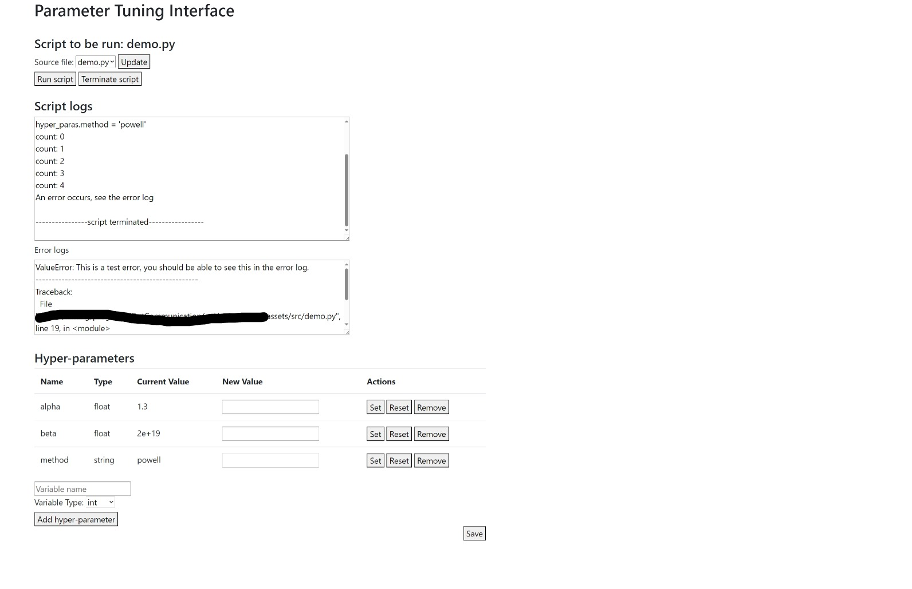

# A GUI for tuning the parameters of the model

## Usage

after install with `pip`, run the following command in the terminal:
```bash
alchemygui [directory]
```

If the `directory` is not given the current directory will be used.

A demo can be run with
```bash
alchemygui demo
```


The `stdout` of the target script will be shown in the log window, and the `stderr` will be shown in the error window.
The save button will save the parameters to the file `paras.json` in the directory.
The saved parameters will be loaded automatically when `alchemy_gui` starts.

It is recommended to add the following code to the head of the script.
The parameters can be accessed from `hyper_paras` in the script.
For example, the parameter `alpha` can be accessed by `hyper_paras.alpha`.

```python
from types import SimpleNamespace
hyper_paras : SimpleNamespace
```

**Warning**: The GUI is still under development and scripts that involve OS-level operations, such as `sys`, `io`, and `os`, may not work the same as running through `python` script`.
This package is only meant for scientific computing and not for production use.
